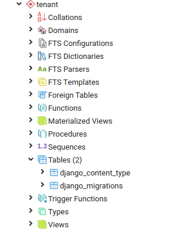

# Django Multi-tenancy

Package Used: [django-tenant-schemas](https://github.com/bernardopires/django-tenant-schemas)

[Documentation](https://django-tenant-schemas.readthedocs.io/en/latest/index.html)

## 1. What's Multi-tencnay?
- Single instance of the software and its supporting infrastructure serves multiple customers

- Isolating one client's(tenant) data from another tenant

- Used in application such as: [SaaS](https://searchcloudcomputing.techtarget.com/definition/Software-as-a-Service)

## 2. Approaches:

- **Isolated Approach**: Separate Databases. Each tenant has it’s own database.

- **Semi Isolated Approach:** Shared Database, Separate Schemas. One database for all tenants, but one [schema](https://www.postgresqltutorial.com/postgresql-schema/) per tenant.

- **Shared Approach:** Shared Database, Shared Schema. All tenants share the same database and schema. There is a main tenant-table, where all other tables have a foreign key pointing to.

- [***Source: ``django-tenant-schemas official docs``***](https://django-tenant-schemas.readthedocs.io/en/latest/index.html#why-schemas)

> django-tenant-schemas uses **Shared approach** where, each tenant's data are stored in a same database under different schema name.

## 3. Setting up multi-tenant application
Before starting, make sure the package is installed on working env(``pip install django && pip install django-tenant-schemas``).

**Start a django project:** 
- ``django-admin startproject <app_name>``

### 3.1 Tweaking Configuration for our application

**i. Create a dataase and map it to our django project**

```python
DATABASES = {
    'default': {
        'ENGINE': 'tenant_schemas.postgresql_backend',
        'NAME': '<db_name>',
        'USER': '<user>',
        'PASSWORD': '<password>',
        'HOST': '<...>',
        'PORT': 5432 # default port unless you change
    }
}
```

**ii. Configure DATABASE ROUTER**
- Database routing allows us to perform different operations(read, write, migrate) operations on different databases of our choice.

- [Database Routing: Django Official](https://docs.djangoproject.com/en/3.0/topics/db/multi-db/#automatic-database-routing)
```python
DATABASE_ROUTERS = (
    'tenant_schemas.routers.TenantSyncRouter',
)
```
> We're using the default one provided by the package. In case of writing custom router refer to the django official docs.

**iii. Configure TEMPLATE_CONTEXT_PROCESSOR:**
- Custom Django context processors allow you to set up data for access on all Django templates

- **Reference:** [Official Docs: Purpose Of Each Context Processor](https://docs.djangoproject.com/en/3.0/ref/templates/api/#built-in-template-context-processors), [Custom Context Processor](https://www.webforefront.com/django/setupdjangocontextprocessors.html), [Creating context processor: Youtube](https://www.youtube.com/watch?v=QTgkGBjjVYM)

```python
TEMPLATE_CONTEXT_PROCESSOR = ('django.context_processors.request',)
```


**iv. Setting up middleware:**
- Sits between the application and the database handelling each request/response cycle.

- Hooks to modify Django request or response object.

-  Use middleware if you want to modify the request i.e ``HttpRequest`` object which is sent to the view. Or you might want to modify the ``HttpResponse`` object returned from the view before view executes.

- Source: [Things to Remember](https://www.agiliq.com/blog/2015/07/understanding-django-middlewares/#things-to-remember-when-using-middleware), [Writing Custom Milddleware](https://www.agiliq.com/blog/2015/07/understanding-django-middlewares/#things-to-remember-when-using-middleware)

```python
MIDDLEWARE = [
    'tenant_schemas.middleware.TenantMiddleware', # ordering matters
    ...
]
```

**v. Create a Tenant Model:**
- Create a new app: ``./manage.py startapp <app-name>``

- Create a tenant model.

```python
from django.db import models
from tenant_schemas.models import TenantMixin

class Client(TenantMixin):
    name = models.CharField(max_length=100)
    paid_until = models.DateField()
    on_trial = models.BooleanField()
    created_on = models.DateField(auto_now_add=True)

    # default true, schema will be automatically created and synced when it is saved
    auto_create_schema = True
```

> When new object of Client will be created, new schema will be created automatically on saving the object.

**vi. Configure Tenant and Shared Apps:**

- Allows to separate the apps that are common and specific to all the tenant.

- Defined using two settings called ``SHARED_APPS = (...,)
`` and ``TENANT_APPS = (...,)``

- Reference: [Configure Tenant And Shared Apps: Official](https://django-tenant-schemas.readthedocs.io/en/latest/install.html#configure-tenant-and-shared-applications)
```python


# make sure all of those apps are also listed in installed Apps

INSTALLED_APPS = [
    'tenant_schemas',
    'customers',
    'django.contrib.admin',
    'django.contrib.auth',
    'django.contrib.contenttypes',
    'django.contrib.sessions',
    'django.contrib.messages',
    'django.contrib.sites',
    'django.contrib.staticfiles',
]

SHARED_APPS = (
    'tenant_schemas', # mandatory, should always be before any django apps
    'customers', # you must list the app where your tenant model resides in

    'django.contrib.contenttypes',

    # everything below here is optional
    'django.contrib.sessions',
    'django.contrib.auth',
    'django.contrib.sites',
    'django.contrib.messages',
    'django.contrib.admin',
)

TENANT_APPS = (
    'django.contrib.contenttypes',
)
```

In the above settings, configuration for session, auth,sites, messaging and administration will be common for all the tenants, i.e those apps will be under the **public** schema.

While there'll be separate contenttype for each of the tenants. 

> Content types are Django's way of identifying database tables. Every Database table is represented as a row in the content type table which is created and maintained by Django. It can track all of the models installed in your Django-powered project, providing a high-level, generic interface for working with your models.

***Source:***  [Wher to use contenttypes](https://django.cowhite.com/blog/where-should-we-use-content-types-and-generic-relations-in-django/), [The contenttypes framework: Django Docs
](https://docs.djangoproject.com/en/3.0/ref/contrib/contenttypes/#module-django.contrib.contenttypes)

**vi. Configure tenant-model:**
- Specifying which model to be used for storing tenant's information. Generally those model are listed in SHARED_APPS. i.e in the ``public`` schema of postgres.


```python
TENANT_MODEL = 'customers.Client'
```

**vi. Migrating:**
- Make migrations: ``./manage.py makemigrations``

- Migrate the shared_applications: ``./manage.py migrate_schemas --shared`` because we don't want the tenant specific data to be migrated in the innitial migration. Tenant specific apps will be created everytime we create a tenant.

## 4. Experimenting with our application

- Drop into the django shel: ``./manage.py shell``

- Import the customer model: ``from app_name.models import Client``

- Create a tenant under the public schema: ``tenant = Cliet(domain_url='localhost.com', schema_name='public', name='Admin', paid_untill='2020-12-02', on_trial=False)`` and save it ``tenant.save()``. Here no new schema will be created as we're creating tenant under the public schema.

- Create a tenant with specific schema: ``tenant = Cliet(domain_url='tenant.localhost.com', schema_name='public', name='Alban', paid_untill='2020-12-02', on_trial=False)``
and save it ``tenant.save()``. In this case a separate schema will be created called tenant.

## 5. Snapshoot:

**1. Shared Schema Structure:**

.png)


**2. Tenant specific schema structure**



